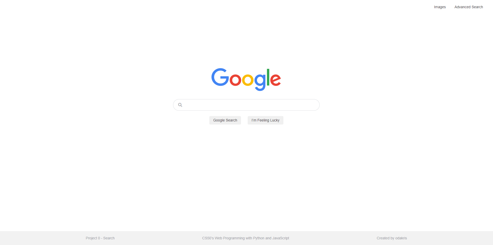
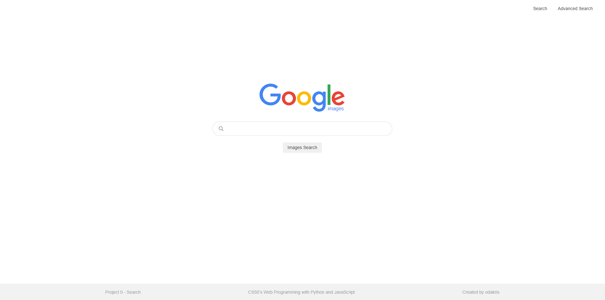
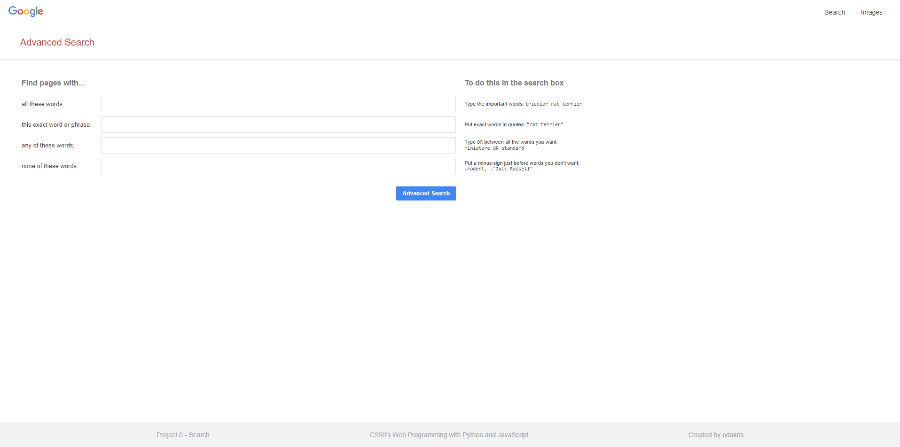

# CS50w - Search


Live demo of **[Search](https://odakris.github.io/cs50w-search/)**

## Description

This is a front-end for Google Search, Google Image Search, and Google Advanced Search. Instructions for completing this project can be found at https://cs50.harvard.edu/web/2020/projects/0/search/

This project is part of the **[CS50’s Web Programming with Python and JavaScript](https://cs50.harvard.edu/web/2020/)**.

### INDEX

<p align="center">
  
</p>

### IMAGES

<p align="center">
  
</p>

### ADVANCED

<p align="center">
  
</p>

## Instructions

Clone this repository and launch :

```
index.html
```

## Credit

**[CS50w](https://pll.harvard.edu/course/cs50s-web-programming-python-and-javascript)**<br>
**[David J. Malan](https://cs.harvard.edu/malan/)**<br>
**[Brian Yu](https://brianyu.me/)**<br>
